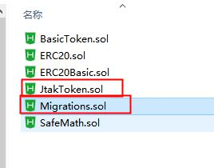
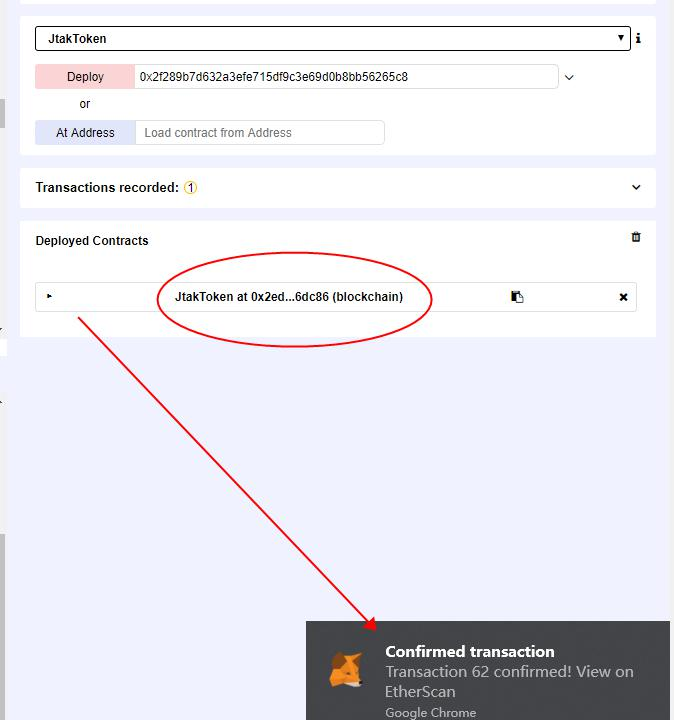
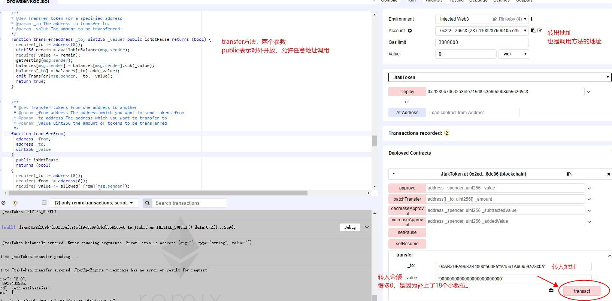

*ETH的智能合约一般用Solidity语言编写，懂点基本solidity语法会更好地测试*

## 测试中需要用到的工具：

* 一份智能合约   

* Remix(一个在线IDE，用来编译、编辑、部署智能合约，需要翻墙才能使用)[点我跳转到Remix](http://remix.ethereum.org)

* ETH测试币-[领取地址](https://faucet.rinkeby.io/)

* ETH测试网络的[区块浏览器](https://rinkeby.etherscan.io)

* ETH钱包MetaMask(Chrome插件)

**下图为remix在线IDE的页面：**


## 测试Solidity合约的步骤：	

> ### 1.编译合约代码	（需要翻墙）		

* 开发智能合约，一般使用Truffle框架，合约写好后的目录结构如下。其中，contracts目录放的就是合约文件！		
* 

* 下图是contracts目录下的文件。		
* 	

* 如果不在本地测试，而是想在remix上测试。除了“Migrations.sol”，其他文件内，全部复制粘贴到Remix上。		

* 然后就可以选择编译器版本，开始编译了。编译后，没有红色的异常提示！说明编译成功，可以开始测试了！		

* 


> ### 2.合约初始化	

* 先登录*metamask*钱包，因为初始化合约，需要一个有ETH余额的地址！用来消耗gas!
* 看个例子：

```
/*合约*/
contract JtakToken is StandardToken {

  string public constant name = "Just Test And Known";
  string public constant symbol = "JTAK";
  uint8 public constant decimals = 18;
  uint256 public constant INITIAL_SUPPLY = 1000000000 * (10 ** uint256(decimals));
  
  /**
  * 这个是合约的初始化方法！"_master"是一个地址类型的初始化参数！
  */
  constructor(address _master) public {
   require(_master != address(0));
   totalSupply_ = INITIAL_SUPPLY;
   master = _master;
   paused = false;
   coinbase = msg.sender;
   balances[coinbase] = INITIAL_SUPPLY;
   }
}
```

* 开始部署合约，点击deploy!	

* 	

* 此时metamask,就让你支付手续费了，直接确认！	

* 		

* 几秒之后，部署成功，然后就可以愉快地调用合约方法了！
* 


> ### 3.调用合约方法。
> 所谓的智能合约测试，说白了！就是合约方法的测试！		

* 展开合约，可以看到该合约的所有方法！	
* 红色表示是写入链上的方法，需要消耗手续费！蓝色表示是查询的方法，不需要消耗手续费！
* 

* 让我们通过调用合约方法，转一笔账，就清楚了！	
* 


## 一般的测试要点：	
* 合约初始化后，Token总量、名称、小数位、分发比例、分发前后的余额等等。	

* 合约方法是否调用SafeMath做运算。（防止上溢、下溢等运算问题）	

* 合约方法的调用权限控制。	

* 高级点的合约，可能还有锁仓、定时分发功能。这些具体业务，具体分析。不展开了~	
