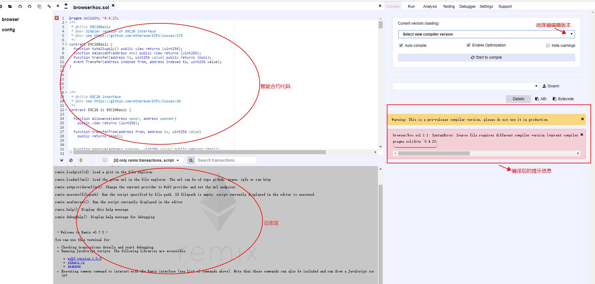

*ETH的智能合约一般用Solidity语言编写，懂点基本solidity语法会更好地测试*

#### 测试中需要用到的工具：

1.一份智能合约   

2.Remix(一个在线IDE，用来编译、编辑、部署智能合约，需要翻墙才能使用)[点我跳转到Remix](http://remix.ethereum.org)

3.ETH测试币-[领取地址](https://faucet.rinkeby.io/)

4.ETH测试网络的[区块浏览器](https://rinkeby.etherscan.io)

5.ETH钱包MetaMask(Chrome插件)

**下图为remix在线IDE的页面：**

